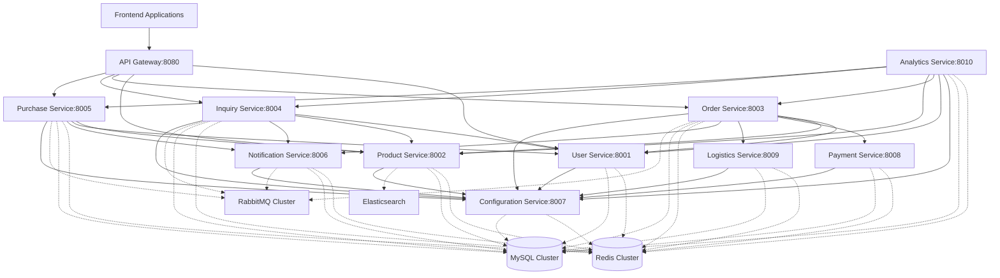

# 万方商事 B2B 采购门户微服务架构设计

## 概述

本文档描述了万方商事 B2B 采购门户的微服务架构设计，基于现有 DDD 架构进行服务拆分，支持系统规模化发展。

## 架构原则

### 1. 业务驱动设计
- 基于领域驱动设计（DDD）的服务边界
- 单一职责原则
- 高内聚、低耦合

### 2. 技术统一性
- 统一的技术栈（PHP 8.2+ / Laravel）
- 标准化的通信协议
- 一致的监控和日志体系

### 3. 可扩展性
- 水平扩展能力
- 独立部署和升级
- 服务自治性

## 服务边界设计

### 核心业务服务

#### 1. 用户服务 (User Service)
**职责**: 用户认证、授权、用户信息管理
```
服务名称: user-service
端口: 8001
数据库: user_db
技术栈: Laravel + JWT + Redis
```

**功能模块**:
- 用户注册/登录
- JWT 令牌管理
- 用户信息管理
- 权限控制
- 用户偏好设置

**API 端点**:
```
POST /api/auth/login
POST /api/auth/register
GET /api/users/profile
PUT /api/users/profile
POST /api/auth/refresh
DELETE /api/auth/logout
```

#### 2. 产品服务 (Product Service)
**职责**: 产品信息管理、库存管理、产品搜索
```
服务名称: product-service
端口: 8002
数据库: product_db
技术栈: Laravel + Elasticsearch + Redis
```

**功能模块**:
- 产品信息管理
- 库存管理
- 产品搜索
- 分类管理
- 价格管理

**API 端点**:
```
GET /api/products
GET /api/products/{id}
POST /api/products
PUT /api/products/{id}
GET /api/products/search
GET /api/categories
```

#### 3. 订单服务 (Order Service)
**职责**: 订单管理、订单状态跟踪、订单历史
```
服务名称: order-service
端口: 8003
数据库: order_db
技术栈: Laravel + Redis + RabbitMQ
```

**功能模块**:
- 订单创建
- 订单状态管理
- 订单查询
- 订单统计
- 订单导出

**API 端点**:
```
POST /api/orders
GET /api/orders
GET /api/orders/{id}
PUT /api/orders/{id}/status
GET /api/orders/statistics
```

#### 4. 询价服务 (Inquiry Service)
**职责**: 询价管理、报价处理、询价历史
```
服务名称: inquiry-service
端口: 8004
数据库: inquiry_db
技术栈: Laravel + Redis + RabbitMQ
```

**功能模块**:
- 询价创建
- 报价管理
- 询价状态跟踪
- 询价历史
- 报价过期管理

**API 端点**:
```
POST /api/inquiries
GET /api/inquiries
GET /api/inquiries/{id}
POST /api/inquiries/{id}/quote
PUT /api/inquiries/{id}/status
```

#### 5. 采购服务 (Purchase Service)
**职责**: 批量采购、采购计划、采购分析
```
服务名称: purchase-service
端口: 8005
数据库: purchase_db
技术栈: Laravel + Redis + RabbitMQ
```

**功能模块**:
- 批量采购订单
- 采购计划管理
- 折扣计算
- 采购分析
- 供应商管理

**API 端点**:
```
POST /api/bulk-purchase
GET /api/bulk-purchase/history
GET /api/bulk-purchase/statistics
POST /api/bulk-purchase/quote
GET /api/purchase/plans
```

### 支撑服务

#### 6. 通知服务 (Notification Service)
**职责**: 消息推送、邮件通知、短信通知
```
服务名称: notification-service
端口: 8006
数据库: notification_db
技术栈: Laravel + Redis + RabbitMQ
```

**功能模块**:
- 邮件通知
- 短信通知
- 推送通知
- 通知模板管理
- 通知历史

**API 端点**:
```
POST /api/notifications/send
GET /api/notifications/history
GET /api/notifications/templates
POST /api/notifications/templates
```

#### 7. 配置服务 (Configuration Service)
**职责**: 系统配置、业务配置、多语言支持
```
服务名称: config-service
端口: 8007
数据库: config_db
技术栈: Laravel + Redis
```

**功能模块**:
- 系统配置管理
- 业务配置管理
- 多语言支持
- 配置缓存
- 配置版本控制

**API 端点**:
```
GET /api/config/{key}
PUT /api/config/{key}
GET /api/config/banho
GET /api/languages
GET /api/currencies
```

#### 8. 支付服务 (Payment Service)
**职责**: 支付处理、支付网关集成、退款处理
```
服务名称: payment-service
端口: 8008
数据库: payment_db
技术栈: Laravel + Redis + 外部支付API
```

**功能模块**:
- 支付处理
- 支付网关集成
- 退款处理
- 支付历史
- 支付安全

**API 端点**:
```
POST /api/payments/process
GET /api/payments/{id}
POST /api/payments/{id}/refund
GET /api/payments/history
GET /api/payment-methods
```

#### 9. 物流服务 (Logistics Service)
**职责**: 物流跟踪、配送管理、物流查询
```
服务名称: logistics-service
端口: 8009
数据库: logistics_db
技术栈: Laravel + Redis + 外部物流API
```

**功能模块**:
- 物流跟踪
- 配送管理
- 物流查询
- 物流成本计算
- 物流商管理

**API 端点**:
```
GET /api/logistics/tracking/{id}
POST /api/logistics/create
GET /api/logistics/cost
GET /api/logistics/providers
PUT /api/logistics/{id}/status
```

#### 10. 分析服务 (Analytics Service)
**职责**: 数据分析、报表生成、业务洞察
```
服务名称: analytics-service
端口: 8010
数据库: analytics_db
技术栈: Laravel + ClickHouse + Redis
```

**功能模块**:
- 业务数据分析
- 报表生成
- 实时统计
- 预测分析
- 数据可视化

**API 端点**:
```
GET /api/analytics/dashboard
GET /api/analytics/reports
POST /api/analytics/custom
GET /api/analytics/predictions
GET /api/analytics/trends
```

## 服务依赖关系图



## 数据库设计策略

### 1. 数据库分离原则
- 每个服务拥有独立的数据库
- 避免跨服务数据库直接访问
- 使用 API 进行数据访问

### 2. 数据一致性
- 最终一致性模型
- 事件驱动架构
- 补偿事务模式

### 3. 数据同步
- 异步事件同步
- CQRS 模式
- 读写分离

## 技术栈统一规范

### 后端技术栈
```
语言: PHP 8.2+
框架: Laravel 12
数据库: MySQL 8.0 / Redis 7.0
消息队列: RabbitMQ 3.12
搜索引擎: Elasticsearch 8.0
容器化: Docker + Docker Compose
编排: Kubernetes
监控: Prometheus + Grafana
日志: ELK Stack
```

### 前端技术栈
```
框架: Vue.js 3 + TypeScript
UI库: Element Plus / Ant Design Vue
构建工具: Vite
状态管理: Pinia
HTTP客户端: Axios
```

### 开发工具
```
代码质量: PHPStan + Psalm
测试框架: PHPUnit + Jest
CI/CD: GitHub Actions
API文档: Swagger/OpenAPI 3.0
```

## 部署架构

### 1. 容器化策略
- 每个服务独立容器
- 多阶段构建优化
- 健康检查机制

### 2. 负载均衡
- Nginx 作为反向代理
- 服务间负载均衡
- 故障转移机制

### 3. 服务发现
- Consul 服务注册
- 健康检查
- 自动服务发现

## 监控和可观测性

### 1. 监控指标
- 应用性能监控 (APM)
- 基础设施监控
- 业务指标监控

### 2. 日志管理
- 统一日志格式
- 集中式日志收集
- 日志分析和告警

### 3. 链路追踪
- 分布式追踪
- 性能瓶颈分析
- 调用链可视化

## 安全架构

### 1. 认证授权
- JWT 令牌认证
- OAuth 2.0 授权
- 服务间认证

### 2. 网络安全
- 服务网格 (Istio)
- 网络策略
- 加密通信

### 3. 数据安全
- 数据加密
- 访问控制
- 审计日志

## 迁移策略

### 阶段 1: 基础设施准备 (1-2个月)
- 搭建容器化平台
- 配置监控系统
- 建立CI/CD流水线

### 阶段 2: 服务拆分 (3-6个月)
- 拆分用户服务
- 拆分产品服务
- 拆分订单服务

### 阶段 3: 功能完善 (2-3个月)
- 拆分支撑服务
- 完善服务治理
- 性能优化

### 阶段 4: 生产迁移 (1个月)
- 灰度发布
- 全量切换
- 监控优化

## 风险评估

### 技术风险
- 服务间通信复杂性
- 数据一致性挑战
- 性能瓶颈

### 业务风险
- 迁移期间服务中断
- 数据丢失风险
- 用户体验影响

### 缓解措施
- 完善的测试策略
- 灰度发布机制
- 快速回滚方案

## 成功指标

### 技术指标
- 服务可用性 > 99.9%
- 响应时间 < 200ms
- 系统吞吐量提升 3倍

### 业务指标
- 部署频率提升 5倍
- 故障恢复时间 < 30分钟
- 开发效率提升 50%

---

**文档版本**: v1.0.0  
**创建日期**: 2025年12月4日  
**最后更新**: 2025年12月4日  
**维护团队**: 万方商事技术团队