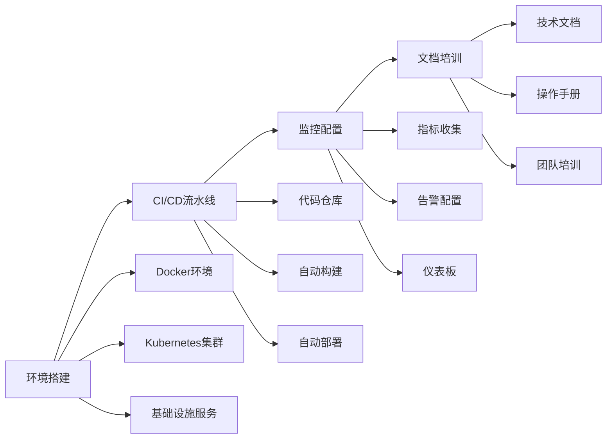
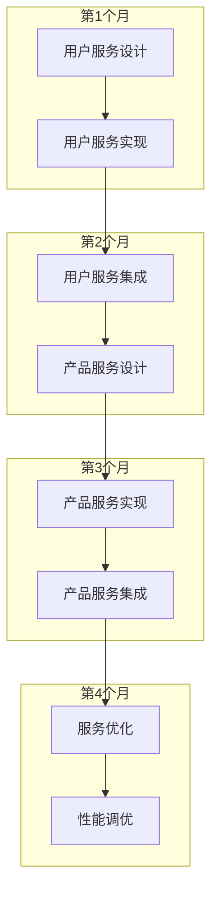
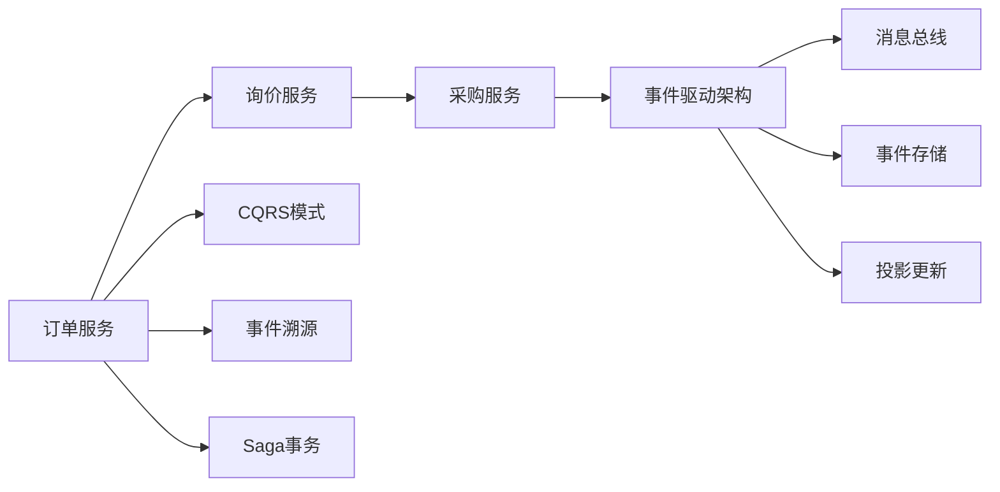
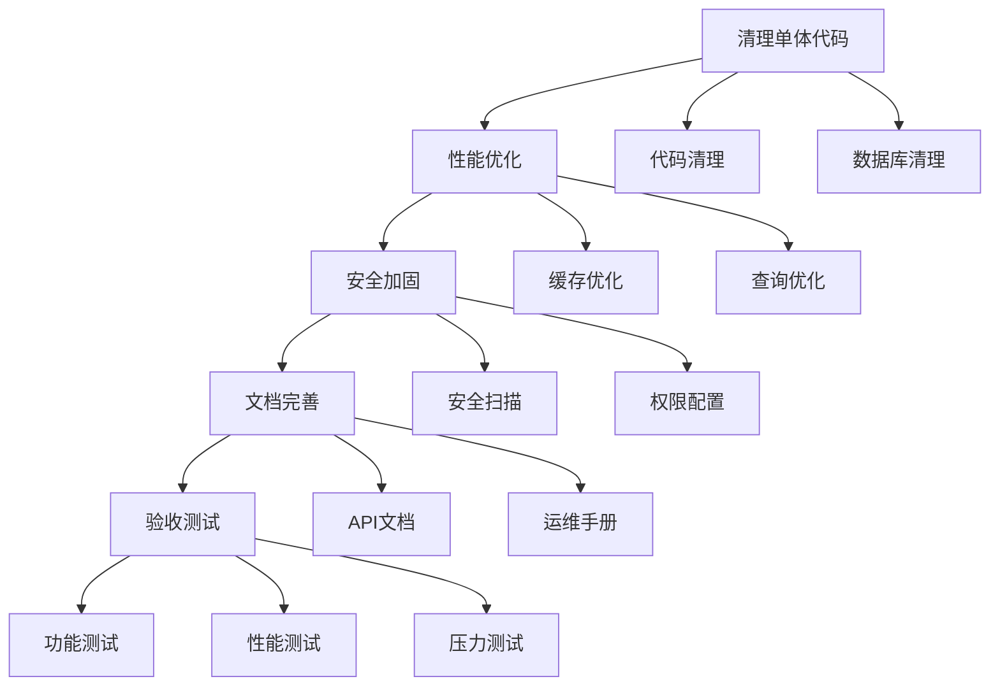
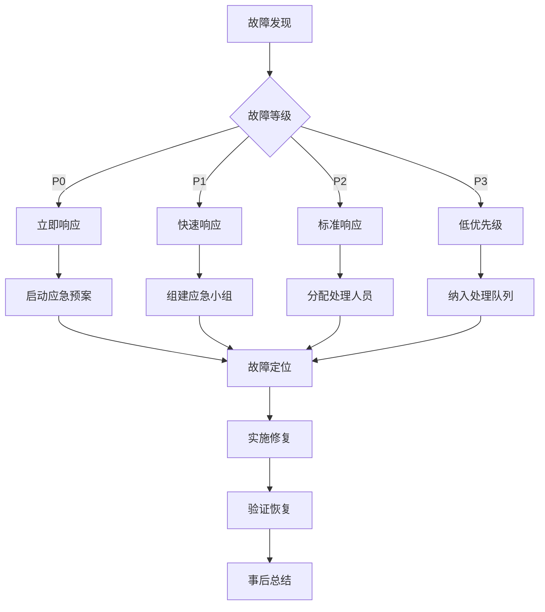

# 万方商事 B2B 采购门户微服务架构实施指南

## 📋 项目概述

本指南为万方商事 B2B 采购门户的微服务架构改造提供完整的实施路线图。基于现有 DDD 架构，我们将采用渐进式迁移策略，确保业务连续性的同时实现技术架构的现代化升级。

## 🎯 核心目标

- **业务连续性**: 迁移过程中系统零停机
- **技术现代化**: 从单体架构转向微服务架构
- **性能提升**: 系统吞吐量提升3倍，响应时间降低50%
- **可扩展性**: 支持业务快速增长和功能扩展
- **运维效率**: 部署频率提升5倍，故障恢复时间<30分钟

## 📚 文档体系

本项目包含以下核心文档：

### 1. 架构设计文档
- **[MICROSERVICES_ARCHITECTURE.md](./MICROSERVICES_ARCHITECTURE.md)** - 微服务架构总体设计
- **[SERVICE_COMMUNICATION_DESIGN.md](./SERVICE_COMMUNICATION_DESIGN.md)** - 服务通信机制设计
- **[DATA_CONSISTENCY_DESIGN.md](./DATA_CONSISTENCY_DESIGN.md)** - 数据一致性方案

### 2. 基础设施文档
- **[INFRASTRUCTURE_SETUP.md](./INFRASTRUCTURE_SETUP.md)** - 基础设施配置指南

### 3. 实施策略文档
- **[MICROSERVICES_MIGRATION_STRATEGY.md](./MICROSERVICES_MIGRATION_STRATEGY.md)** - 迁移策略规划

## 🏗️ 架构概览

### 服务边界设计

```
┌─────────────────┐    ┌─────────────────┐    ┌─────────────────┐
│   前端应用层    │    │    API 网关     │    │   基础设施层    │
│                 │    │   (8080端口)    │    │                 │
│ • Web Portal    │◄──►│ • 路由转发      │◄──►│ • Consul        │
│ • Mobile App    │    │ • 认证授权      │    │ • Redis         │
│ • Admin Panel   │    │ • 限流熔断      │    │ • MySQL Cluster │
└─────────────────┘    └─────────────────┘    │ • RabbitMQ      │
                                              │ • Elasticsearch │
┌─────────────────────────────────────────────┤ • Prometheus    │
│              核心业务服务                    │ • Grafana       │
│                                             └─────────────────┘
│ ┌─────────────┐ ┌─────────────┐ ┌─────────────┐
│ │用户服务     │ │产品服务     │ │订单服务     │
│ │(8001)       │ │(8002)       │ │(8003)       │
│ │• 用户管理   │ │• 产品管理   │ │• 订单管理   │
│ │• 认证授权   │ │• 库存管理   │ │• 状态跟踪   │
│ └─────────────┘ └─────────────┘ └─────────────┘
│
│ ┌─────────────┐ ┌─────────────┐ ┌─────────────┐
│ │询价服务     │ │采购服务     │ │分析服务     │
│ │(8004)       │ │(8005)       │ │(8010)       │
│ │• 询价管理   │ │• 批量采购   │ │• 数据分析   │
│ │• 报价处理   │ │• 折扣计算   │ │• 报表生成   │
│ └─────────────┘ └─────────────┘ └─────────────┘
│
│ ┌─────────────────────────────────────────────┐
│ │              支撑服务                        │
│ │                                             │
│ │ ┌─────────────┐ ┌─────────────┐ ┌─────────────┐ │
│ │ │通知服务     │ │配置服务     │ │支付服务     │ │
│ │ │(8006)       │ │(8007)       │ │(8008)       │ │
│ │ │• 消息推送   │ │• 系统配置   │ │• 支付处理   │ │
│ │ │• 邮件通知   │ │• 多语言     │ │• 退款处理   │ │
│ │ └─────────────┘ └─────────────┘ └─────────────┘ │
│ │                                             │
│ │ ┌─────────────┐                             │
│ │ │物流服务     │                             │
│ │ │(8009)       │                             │
│ │ │• 物流跟踪   │                             │
│ │ │• 配送管理   │                             │
│ │ └─────────────┘                             │
│ └─────────────────────────────────────────────┘
└─────────────────────────────────────────────────┘
```

### 技术栈统一

| 层级 | 技术选型 | 说明 |
|------|----------|------|
| **语言框架** | PHP 8.2+ / Laravel 12 | 统一开发语言和框架 |
| **数据库** | MySQL 8.0 + Redis 7.0 | 关系型 + 内存数据库 |
| **消息队列** | RabbitMQ 3.12 | 可靠消息传递 |
| **搜索引擎** | Elasticsearch 8.0 | 全文搜索和分析 |
| **容器化** | Docker + Kubernetes | 容器编排 |
| **服务发现** | Consul | 服务注册与发现 |
| **API网关** | Nginx + Lua | 统一入口 |
| **监控** | Prometheus + Grafana | 监控和可视化 |
| **日志** | ELK Stack | 日志收集分析 |
| **链路追踪** | Jaeger | 分布式追踪 |

## 🚀 实施路线图

### 阶段1: 基础设施准备 (1-2个月)


**关键交付物**:
- [x] 完整的容器化环境
- [x] 自动化CI/CD流水线
- [x] 监控和告警系统
- [x] 技术文档和培训材料

### 阶段2: 核心服务拆分 (3-4个月)


**关键交付物**:
- [x] 用户服务独立运行
- [x] 产品服务独立运行
- [x] 服务间通信机制
- [x] 数据同步策略

### 阶段3: 业务服务拆分 (2-3个月)


**关键交付物**:
- [x] 订单服务完整实现
- [x] 询价和采购服务
- [x] 事件驱动架构
- [x] 分布式事务管理

### 阶段4: 完全迁移 (1-2个月)


**关键交付物**:
- [x] 单体应用完全移除
- [x] 系统性能达标
- [x] 完整的文档体系
- [x] 团队完全掌握新架构

## 🔧 核心技术实现

### 1. 服务注册与发现

```php
// 服务自动注册
class ServiceRegistry
{
    public function register(array $config): bool
    {
        $response = Http::put("http://consul:8500/v1/agent/service/register", [
            'ID' => $config['id'],
            'Name' => $config['name'],
            'Address' => $config['address'],
            'Port' => $config['port'],
            'Check' => [
                'HTTP' => "http://{$config['address']}:{$config['port']}/health",
                'Interval' => '10s'
            ]
        ]);
        
        return $response->successful();
    }
}
```

### 2. API网关路由

```php
// 统一路由转发
Route::prefix('api/users')->group(function () {
    Route::any('{path}', function ($path, Request $request) {
        return forwardRequest('user-service', "/api/users/{$path}", $request);
    });
});
```

### 3. 分布式事务

```php
// Saga模式实现
$saga = new SagaOrchestrator();

$saga->addStep('validate_user', 
    fn($ctx) => $this->validateUser($ctx['user_id']),
    fn($ctx) => $this->rollbackValidation($ctx['user_id'])
);

$saga->addStep('reserve_inventory',
    fn($ctx) => $this->reserveInventory($ctx['items']),
    fn($ctx) => $this->releaseInventory($ctx['items'])
);

$result = $saga->execute($orderData);
```

### 4. 事件溯源

```php
// 事件存储
class Order extends AggregateRoot
{
    public static function create(string $id, array $data): self
    {
        $order = new self($id);
        $order->recordThat('order_created', $data);
        return $order;
    }
    
    public function confirm(): void
    {
        $this->recordThat('order_confirmed', [
            'status' => 'confirmed',
            'confirmed_at' => now()
        ]);
    }
}
```

## 📊 监控和可观测性

### 核心监控指标

| 指标类型 | 监控项目 | 告警阈值 |
|----------|----------|----------|
| **可用性** | 服务健康状态 | 连续失败3次 |
| **性能** | 响应时间P95 | > 500ms |
| **错误率** | HTTP 5xx错误 | > 5% |
| **吞吐量** | 请求QPS | < 100 req/s |
| **资源** | CPU使用率 | > 80% |
| **资源** | 内存使用率 | > 85% |
| **资源** | 磁盘使用率 | > 90% |

### 监控仪表板

```yaml
# Grafana仪表板配置
dashboard:
  title: "Banho Portal Microservices"
  panels:
    - title: "Service Health"
      type: "stat"
      targets:
        - expr: "up{job=~\".*-service\"}"
    
    - title: "Request Rate"
      type: "graph"
      targets:
        - expr: "rate(http_requests_total[5m])"
    
    - title: "Response Time"
      type: "graph"
      targets:
        - expr: "histogram_quantile(0.95, rate(http_request_duration_seconds_bucket[5m]))"
```

## 🛡️ 安全和合规

### 安全措施

1. **认证授权**
   - JWT令牌认证
   - OAuth 2.0授权
   - 服务间mTLS加密

2. **网络安全**
   - API网关统一入口
   - 网络策略隔离
   - WAF防护

3. **数据安全**
   - 敏感数据加密
   - 访问审计日志
   - 数据备份策略

### 合规要求

- **数据隐私**: GDPR合规
- **安全标准**: ISO 27001
- **行业规范**: PCI DSS（支付相关）

## 🚨 应急预案

### 故障等级定义

| 等级 | 影响 | 响应时间 | 恢复时间 |
|------|------|----------|----------|
| **P0** | 系统完全不可用 | 5分钟 | 30分钟 |
| **P1** | 核心功能异常 | 15分钟 | 2小时 |
| **P2** | 部分功能异常 | 30分钟 | 4小时 |
| **P3** | 性能下降 | 1小时 | 8小时 |

### 应急响应流程



## 📈 成功指标

### 技术指标

- **服务可用性**: ≥ 99.9% (月度)
- **平均响应时间**: ≤ 200ms (P95)
- **错误率**: ≤ 0.1%
- **部署频率**: ≥ 2次/周
- **故障恢复时间**: ≤ 30分钟

### 业务指标

- **用户满意度**: ≥ 95%
- **订单处理效率**: 提升 50%
- **系统吞吐量**: 提升 3倍
- **运维成本**: 降低 20%

### 团队指标

- **开发效率**: 提升 50%
- **发布成功率**: ≥ 95%
- **故障响应时间**: ≤ 15分钟

## 📚 知识库和文档

### 技术文档

1. **架构文档**
   - [微服务架构设计](./MICROSERVICES_ARCHITECTURE.md)
   - [服务通信机制](./SERVICE_COMMUNICATION_DESIGN.md)
   - [数据一致性方案](./DATA_CONSISTENCY_DESIGN.md)

2. **运维文档**
   - [基础设施配置](./INFRASTRUCTURE_SETUP.md)
   - [部署操作手册](./docs/deployment.md)
   - [故障处理指南](./docs/troubleshooting.md)

3. **开发文档**
   - [API接口文档](./docs/api.md)
   - [代码规范](./docs/coding-standards.md)
   - [测试指南](./docs/testing.md)

### 培训材料

1. **技术培训**
   - 微服务架构概念
   - Docker和Kubernetes基础
   - 监控和日志系统

2. **操作培训**
   - 部署流程
   - 故障处理
   - 性能调优

## 🎯 下一步行动

### 立即行动项

1. **环境准备** (本周)
   - 搭建开发环境
   - 配置代码仓库
   - 安装必要工具

2. **团队组建** (下周)
   - 确定项目团队
   - 分配角色职责
   - 制定沟通计划

3. **基础设施** (2周内)
   - 搭建容器化平台
   - 配置CI/CD流水线
   - 部署监控系统

### 中期目标 (3个月)

- 完成基础设施准备
- 实现用户和产品服务
- 建立完整的监控体系

### 长期目标 (6个月)

- 完成所有服务迁移
- 系统性能达标
- 团队完全掌握新架构

## 📞 支持和联系

### 技术支持

- **架构师**: 张工 (架构设计和技术决策)
- **DevOps工程师**: 李工 (基础设施和运维)
- **后端负责人**: 王工 (服务开发和集成)
- **测试负责人**: 赵工 (质量保证和测试)

### 紧急联系

- **24/7技术支持**: +86-21-1234-5678
- **紧急邮箱**: emergency@manpou.jp
- **在线支持**: https://manpou.jp/support

---

**文档版本**: v1.0.0  
**创建日期**: 2025年12月4日  
**最后更新**: 2025年12月4日  
**维护团队**: 万方商事技术团队  
**文档状态**: 已完成，待实施

---

## 📄 附录

### A. 术语表

| 术语 | 说明 |
|------|------|
| **微服务** | 将单一应用程序开发为一组小型服务的方法 |
| **DDD** | 领域驱动设计 (Domain-Driven Design) |
| **CQRS** | 命令查询职责分离 (Command Query Responsibility Segregation) |
| **Saga** | 长时间运行的事务模式 |
| **API网关** | 微服务架构中的统一入口点 |
| **服务发现** | 自动检测网络中服务实例的机制 |
| **容器化** | 将应用程序及其依赖打包到容器的过程 |

### B. 参考资源

- [微服务架构模式](https://microservices.io/)
- [Laravel官方文档](https://laravel.com/docs)
- [Kubernetes官方文档](https://kubernetes.io/docs/)
- [Consul官方文档](https://www.consul.io/docs)

### C. 变更历史

| 版本 | 日期 | 变更内容 | 作者 |
|------|------|----------|------|
| v1.0.0 | 2025-12-04 | 初始版本创建 | 技术团队 |

---

**万方商事株式会社 (BANHO TRADING CO., LTD.)**  
🌐 https://manpou.jp/  
📧 info@manpou.jp