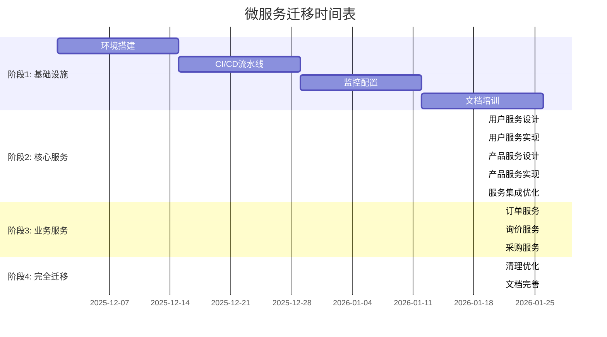

# 微服务迁移策略规划

## 概述

本文档详细描述了万方商事 B2B 采购门户从单体架构向微服务架构迁移的完整策略，包括渐进式迁移方案、时间表、风险管理和应急措施。

## 1. 迁移策略概述

### 1.1 迁移原则

1. **渐进式迁移**: 逐步拆分服务，避免大爆炸式重构
2. **业务连续性**: 确保迁移过程中系统可用性
3. **数据一致性**: 维护数据完整性和一致性
4. **回滚能力**: 每个阶段都有明确的回滚方案
5. **性能保障**: 迁移不能影响系统性能

### 1.2 迁移模式选择

采用**绞杀者模式 (Strangler Fig Pattern)**进行渐进式迁移：

```
单体应用 → API网关 → 微服务逐步替换 → 完全微服务化
```

### 1.3 迁移阶段规划

| 阶段 | 时间 | 主要任务 | 风险等级 |
|------|------|----------|----------|
| 阶段1 | 1-2个月 | 基础设施准备 | 低 |
| 阶段2 | 3-4个月 | 核心服务拆分 | 中 |
| 阶段3 | 2-3个月 | 业务服务拆分 | 中 |
| 阶段4 | 1-2个月 | 完全迁移 | 高 |

## 2. 阶段1: 基础设施准备 (1-2个月)

### 2.1 目标
- 搭建微服务基础设施
- 建立CI/CD流水线
- 配置监控和日志系统
- 准备容器化环境

### 2.2 详细任务

#### 第1-2周: 环境搭建
```bash
# 任务清单
□ 搭建Docker容器化环境
□ 配置Kubernetes集群
□ 安装Consul服务注册中心
□ 配置Redis集群
□ 搭建MySQL集群
□ 安装RabbitMQ消息队列
□ 配置Elasticsearch
□ 搭建监控系统 (Prometheus + Grafana)
```

#### 第3-4周: CI/CD流水线
```yaml
# .github/workflows/microservices-ci.yml
name: Microservices CI/CD

on:
  push:
    branches: [develop, microservices]
  pull_request:
    branches: [develop]

jobs:
  test:
    runs-on: ubuntu-latest
    strategy:
      matrix:
        service: [user-service, product-service, order-service]
    
    steps:
    - uses: actions/checkout@v3
    
    - name: Setup PHP
      uses: shivammathur/setup-php@v2
      with:
        php-version: '8.2'
        extensions: mbstring, bcmath, pdo_mysql
        
    - name: Install dependencies
      run: composer install --prefer-dist --no-progress
      
    - name: Run tests
      run: |
        cd services/${{ matrix.service }}
        php artisan test
        
    - name: Build Docker image
      run: |
        docker build -t banho-portal/${{ matrix.service }}:${{ github.sha }} .
        
    - name: Push to registry
      if: github.ref == 'refs/heads/develop'
      run: |
        echo ${{ secrets.DOCKER_PASSWORD }} | docker login -u ${{ secrets.DOCKER_USERNAME }} --password-stdin
        docker push banho-portal/${{ matrix.service }}:${{ github.sha }}

  deploy:
    needs: test
    runs-on: ubuntu-latest
    if: github.ref == 'refs/heads/develop'
    
    steps:
    - name: Deploy to staging
      run: |
        kubectl set image deployment/${{ matrix.service }} ${{ matrix.service }}=banho-portal/${{ matrix.service }}:${{ github.sha }} -n staging
        kubectl rollout status deployment/${{ matrix.service }} -n staging
```

#### 第5-6周: 监控配置
```yaml
# monitoring/prometheus-rules.yml
groups:
- name: banho-portal.rules
  rules:
  - alert: ServiceDown
    expr: up == 0
    for: 1m
    labels:
      severity: critical
    annotations:
      summary: "Service {{ $labels.job }} is down"
      description: "Service {{ $labels.job }} has been down for more than 1 minute."
      
  - alert: HighErrorRate
    expr: rate(http_requests_total{status=~"5.."}[5m]) / rate(http_requests_total[5m]) > 0.05
    for: 2m
    labels:
      severity: warning
    annotations:
      summary: "High error rate on {{ $labels.service }}"
      description: "Error rate is {{ $value | humanizePercentage }}"
      
  - alert: HighResponseTime
    expr: histogram_quantile(0.95, rate(http_request_duration_seconds_bucket[5m])) > 1
    for: 5m
    labels:
      severity: warning
    annotations:
      summary: "High response time on {{ $labels.service }}"
      description: "95th percentile response time is {{ $value }}s"
```

#### 第7-8周: 文档和培训
- 完善技术文档
- 团队培训
- 制定操作手册

### 2.3 验收标准
- [ ] 所有基础设施组件正常运行
- [ ] CI/CD流水线可以自动部署
- [ ] 监控系统可以收集指标
- [ ] 团队掌握新技术栈

## 3. 阶段2: 核心服务拆分 (3-4个月)

### 3.1 目标
- 拆分用户服务
- 拆分产品服务
- 建立服务间通信
- 实施数据同步

### 3.2 用户服务拆分

#### 第1个月: 用户服务设计与实现
```php
// 迁移步骤
1. 分析现有用户相关代码
2. 设计用户服务API
3. 创建用户服务数据库
4. 实现用户服务核心功能
5. 编写测试用例
6. 部署到测试环境
```

**API设计**:
```php
// app/Http/Controllers/Api/UserController.php
class UserController extends Controller
{
    public function show($id)
    {
        $user = $this->userService->getUser($id);
        return ApiResponseService::success($user);
    }
    
    public function update(Request $request, $id)
    {
        $validated = $request->validate([
            'name' => 'required|string|max:255',
            'email' => 'required|email|unique:users,email,'.$id,
        ]);
        
        $user = $this->userService->updateUser($id, $validated);
        return ApiResponseService::success($user);
    }
}
```

**数据迁移脚本**:
```php
// database/migrations/migrate_users_to_microservice.php
class MigrateUsersToMicroservice extends Migration
{
    public function up()
    {
        // 1. 创建用户服务数据库表
        Schema::connection('user_service')->create('users', function (Blueprint $table) {
            $table->id();
            $table->string('name');
            $table->string('email')->unique();
            $table->timestamp('email_verified_at')->nullable();
            $table->string('password');
            $table->rememberToken();
            $table->timestamps();
        });
        
        // 2. 迁移数据
        DB::transaction(function () {
            $users = DB::connection('monolith')->table('users')->get();
            
            foreach ($users as $user) {
                DB::connection('user_service')->table('users')->insert([
                    'id' => $user->id,
                    'name' => $user->name,
                    'email' => $user->email,
                    'password' => $user->password,
                    'created_at' => $user->created_at,
                    'updated_at' => $user->updated_at,
                ]);
            }
        });
    }
}
```

#### 第2个月: 用户服务集成
```php
// API网关路由配置
// routes/gateway.php
Route::prefix('api/users')->group(function () {
    Route::get('/{id}', function ($id) {
        return forwardRequest('user-service', "/api/users/{$id}");
    });
    
    Route::put('/{id}', function (Request $request, $id) {
        return forwardRequest('user-service', "/api/users/{$id}", $request);
    });
});
```

### 3.3 产品服务拆分

#### 第3个月: 产品服务实现
```php
// 产品服务核心功能
class ProductService
{
    public function getProduct($id)
    {
        // 从产品数据库获取
        $product = Product::find($id);
        
        // 如果不存在，从单体应用同步
        if (!$product) {
            $this->syncProductFromMonolith($id);
            $product = Product::find($id);
        }
        
        return $product;
    }
    
    private function syncProductFromMonolith($id)
    {
        $monolithProduct = DB::connection('monolith')
            ->table('products')
            ->where('id', $id)
            ->first();
            
        if ($monolithProduct) {
            Product::create((array) $monolithProduct);
        }
    }
}
```

#### 第4个月: 产品服务集成和优化
- 实现产品搜索功能
- 集成Elasticsearch
- 性能优化
- 缓存策略实施

### 3.4 数据同步策略

#### 双写模式
```php
// 数据同步服务
class DataSyncService
{
    public function syncUserUpdate($userId, $data)
    {
        DB::transaction(function () use ($userId, $data) {
            // 1. 更新单体应用数据库
            DB::connection('monolith')
                ->table('users')
                ->where('id', $userId)
                ->update($data);
            
            // 2. 更新微服务数据库
            DB::connection('user_service')
                ->table('users')
                ->where('id', $userId)
                ->update($data);
            
            // 3. 发布事件
            event(new UserUpdated($userId, $data));
        });
    }
}
```

#### 读写分离
```php
// 路由中间件
class ServiceRouter
{
    public function handle($request, Closure $next)
    {
        $service = $this->determineService($request);
        
        if ($this->isServiceMigrated($service)) {
            return $this->forwardToMicroservice($request, $service);
        } else {
            return $this->forwardToMonolith($request);
        }
    }
    
    private function isServiceMigrated($service)
    {
        return config("services.migrated.{$service}", false);
    }
}
```

### 3.5 验收标准
- [ ] 用户服务独立运行
- [ ] 产品服务独立运行
- [ ] 数据同步正常
- [ ] 性能无明显下降

## 4. 阶段3: 业务服务拆分 (2-3个月)

### 4.1 目标
- 拆分订单服务
- 拆分询价服务
- 拆分采购服务
- 实施事件驱动架构

### 4.2 订单服务拆分

#### 第1个月: 订单服务设计
```php
// 订单聚合根
class Order extends AggregateRoot
{
    public static function create(string $id, string $userId, array $items): self
    {
        $order = new self($id);
        
        $order->recordThat('order_created', [
            'user_id' => $userId,
            'items' => $items,
            'status' => 'pending',
            'total_amount' => $this->calculateTotal($items)
        ]);
        
        return $order;
    }
    
    public function confirm(): void
    {
        $this->recordThat('order_confirmed', [
            'previous_status' => $this->status,
            'new_status' => 'confirmed'
        ]);
    }
}
```

#### 第2个月: 订单服务实现
- CQRS模式实施
- 事件溯源
- Saga事务模式

### 4.3 询价和采购服务

#### 第3个月: 剩余服务拆分
```php
// 询价服务
class InquiryService
{
    public function createInquiry(array $data): Inquiry
    {
        $inquiry = Inquiry::create($data);
        
        // 发布询价创建事件
        event(new InquiryCreated($inquiry));
        
        return $inquiry;
    }
}

// 采购服务
class PurchaseService
{
    public function processBulkPurchase(array $items): PurchaseOrder
    {
        $saga = new SagaOrchestrator();
        
        $saga->addStep('validate_products', 
            fn($context) => $this->validateProducts($context['items']),
            fn($context) => $this->rollbackValidation($context['items'])
        );
        
        $saga->addStep('reserve_inventory',
            fn($context) => $this->reserveInventory($context['items']),
            fn($context) => $this->releaseInventory($context['items'])
        );
        
        return $saga->execute(['items' => $items]);
    }
}
```

### 4.4 验收标准
- [ ] 所有业务服务独立运行
- [ ] 事件驱动架构正常
- [ ] 端到端业务流程完整
- [ ] 性能满足要求

## 5. 阶段4: 完全迁移 (1-2个月)

### 5.1 目标
- 移除单体应用依赖
- 优化系统性能
- 完善监控和运维
- 文档完善

### 5.2 迁移收尾工作

#### 第1个月: 清理和优化
```bash
# 清理任务
□ 移除单体应用代码
□ 清理无用数据库表
□ 优化网络配置
□ 性能调优
□ 安全加固
```

#### 第2个月: 完善和文档
```bash
# 完善任务
□ 完善监控告警
□ 更新操作文档
□ 团队培训
□ 应急演练
□ 性能测试
```

### 5.3 验收标准
- [ ] 单体应用完全移除
- [ ] 所有微服务正常运行
- [ ] 性能指标达标
- [ ] 团队完全掌握新架构

## 6. 风险管理

### 6.1 技术风险

#### 服务间通信故障
**风险等级**: 高
**影响**: 服务间调用失败，系统功能异常
**缓解措施**:
```php
// 断路器模式
class CircuitBreaker
{
    private $failureCount = 0;
    private $lastFailureTime = null;
    private $state = 'CLOSED'; // CLOSED, OPEN, HALF_OPEN
    
    public function call(callable $operation)
    {
        if ($this->state === 'OPEN') {
            if (time() - $this->lastFailureTime > 60) {
                $this->state = 'HALF_OPEN';
            } else {
                throw new ServiceUnavailableException();
            }
        }
        
        try {
            $result = $operation();
            $this->onSuccess();
            return $result;
        } catch (Exception $e) {
            $this->onFailure();
            throw $e;
        }
    }
}
```

#### 数据一致性问题
**风险等级**: 高
**影响**: 数据不一致，业务逻辑错误
**缓解措施**:
```php
// 分布式事务
class SagaTransaction
{
    public function execute(array $operations)
    {
        $executed = [];
        
        try {
            foreach ($operations as $operation) {
                $result = $operation['execute']();
                $executed[] = ['operation' => $operation, 'result' => $result];
            }
            return true;
        } catch (Exception $e) {
            // 执行补偿操作
            foreach (array_reverse($executed) as $item) {
                try {
                    $item['operation']['compensate']($item['result']);
                } catch (Exception $compensateException) {
                    // 记录补偿失败，需要人工介入
                    Log::error('Compensation failed', [
                        'operation' => $item['operation'],
                        'error' => $compensateException->getMessage()
                    ]);
                }
            }
            throw $e;
        }
    }
}
```

### 6.2 业务风险

#### 服务中断
**风险等级**: 高
**影响**: 用户无法访问系统
**缓解措施**:
- 蓝绿部署
- 金丝雀发布
- 自动回滚机制

```bash
# 蓝绿部署脚本
#!/bin/bash
# blue-green-deploy.sh

CURRENT_ENV=$(kubectl get service banho-portal -o jsonpath='{.spec.selector.env}')
NEW_ENV="blue"

if [ "$CURRENT_ENV" = "blue" ]; then
    NEW_ENV="green"
fi

echo "Deploying to $NEW_ENV environment..."

# 部署新版本
kubectl apply -f deployment-${NEW_ENV}.yaml

# 等待新版本就绪
kubectl wait --for=condition=ready pod -l env=$NEW_ENV --timeout=300s

# 切换流量
kubectl patch service banho-portal -p '{"spec":{"selector":{"env":"'$NEW_ENV'"}}}'

echo "Traffic switched to $NEW_ENV environment"

# 健康检查
sleep 30
if curl -f http://banho-portal/health; then
    echo "Deployment successful"
else
    echo "Health check failed, rolling back..."
    kubectl patch service banho-portal -p '{"spec":{"selector":{"env":"'$CURRENT_ENV'"}}}'
    exit 1
fi
```

#### 性能下降
**风险等级**: 中
**影响**: 用户体验下降
**缓解措施**:
- 性能监控
- 自动扩缩容
- 缓存优化

```yaml
# 自动扩缩容配置
apiVersion: autoscaling/v2
kind: HorizontalPodAutoscaler
metadata:
  name: user-service-hpa
spec:
  scaleTargetRef:
    apiVersion: apps/v1
    kind: Deployment
    name: user-service
  minReplicas: 2
  maxReplicas: 10
  metrics:
  - type: Resource
    resource:
      name: cpu
      target:
        type: Utilization
        averageUtilization: 70
  - type: Resource
    resource:
      name: memory
      target:
        type: Utilization
        averageUtilization: 80
```

### 6.3 运维风险

#### 团队技能不足
**风险等级**: 中
**影响**: 运维效率低下，故障处理不及时
**缓解措施**:
- 技术培训
- 文档完善
- 专家支持

#### 监控盲区
**风险等级**: 中
**影响**: 问题发现不及时
**缓解措施**:
- 全链路监控
- 智能告警
- 定期演练

## 7. 应急预案

### 7.1 回滚预案

#### 服务级回滚
```bash
#!/bin/bash
# rollback-service.sh

SERVICE=$1
VERSION=$2

echo "Rolling back $SERVICE to version $VERSION..."

# 1. 停止新版本部署
kubectl scale deployment $SERVICE --replicas=0

# 2. 部署旧版本
kubectl set image deployment/$SERVICE $SERVICE=banho-portal/$SERVICE:$VERSION

# 3. 启动服务
kubectl scale deployment $SERVICE --replicas=3

# 4. 等待就绪
kubectl rollout status deployment/$SERVICE --timeout=300s

echo "Rollback completed for $SERVICE"
```

#### 全量回滚
```bash
#!/bin/bash
# emergency-rollback.sh

echo "Emergency rollback initiated..."

# 1. 切换到单体应用
kubectl patch service banho-portal -p '{"spec":{"selector":{"env":"monolith"}}}'

# 2. 停止所有微服务
kubectl scale deployment --all --replicas=0

# 3. 验证单体应用运行
if curl -f http://banho-portal/health; then
    echo "Emergency rollback successful"
else
    echo "Emergency rollback failed - manual intervention required"
    exit 1
fi
```

### 7.2 数据修复预案

#### 数据不一致修复
```php
// 数据修复脚本
class DataRepairService
{
    public function repairUserInconsistency($userId)
    {
        // 1. 备份当前数据
        $this->backupUserData($userId);
        
        // 2. 比较数据差异
        $monolithUser = DB::connection('monolith')
            ->table('users')
            ->where('id', $userId)
            ->first();
            
        $microserviceUser = DB::connection('user_service')
            ->table('users')
            ->where('id', $userId)
            ->first();
        
        // 3. 修复数据
        if ($this->hasDataDifference($monolithUser, $microserviceUser)) {
            $this->synchronizeUserData($userId, $monolithUser);
        }
        
        // 4. 验证修复结果
        $this->validateDataConsistency($userId);
    }
}
```

### 7.3 通信中断预案

#### 服务降级
```php
// 服务降级中间件
class ServiceDegradationMiddleware
{
    public function handle($request, Closure $next)
    {
        try {
            return $next($request);
        } catch (ServiceUnavailableException $e) {
            // 启用降级模式
            return $this->handleDegradation($request);
        }
    }
    
    private function handleDegradation($request)
    {
        $service = $this->getServiceFromRequest($request);
        
        switch ($service) {
            case 'user-service':
                return $this->getUserFromCache($request);
            case 'product-service':
                return $this->getProductFromCache($request);
            default:
                return response()->json([
                    'message' => 'Service temporarily unavailable',
                    'code' => 'SERVICE_DEGRADATION'
                ], 503);
        }
    }
}
```

## 8. 成功指标

### 8.1 技术指标
- **服务可用性**: ≥ 99.9%
- **响应时间**: P95 < 200ms
- **错误率**: < 0.1%
- **部署频率**: 每周 ≥ 2次
- **故障恢复时间**: < 30分钟

### 8.2 业务指标
- **用户满意度**: ≥ 95%
- **订单处理效率**: 提升 50%
- **系统吞吐量**: 提升 3倍
- **运维成本**: 降低 20%

### 8.3 团队指标
- **开发效率**: 提升 50%
- **发布成功率**: ≥ 95%
- **故障响应时间**: < 15分钟

## 9. 迁移时间表

### 9.1 详细时间安排



### 9.2 里程碑检查点

| 里程碑 | 时间 | 检查内容 | 负责人 |
|--------|------|----------|--------|
| M1 | 2025-12-31 | 基础设施就绪 | 基础设施团队 |
| M2 | 2026-02-28 | 核心服务上线 | 后端团队 |
| M3 | 2026-05-31 | 业务服务完成 | 全栈团队 |
| M4 | 2026-07-31 | 完全迁移成功 | 项目经理 |

## 10. 总结

微服务迁移是一个复杂的过程，需要周密的计划和严格的执行。通过渐进式迁移策略，我们可以最大程度地降低风险，确保业务连续性，同时实现技术架构的升级。

关键成功因素：
1. **充分的准备**: 基础设施和工具链的完善
2. **渐进式实施**: 避免大爆炸式重构
3. **严格的质量控制**: 每个阶段都有明确的验收标准
4. **完善的应急预案**: 确保出现问题时能快速响应
5. **团队能力建设**: 确保团队掌握新技术栈

通过遵循本迁移策略，万方商事 B2B 采购门户将成功转型为现代化的微服务架构，为未来的业务发展奠定坚实的技术基础。

---

**文档版本**: v1.0.0  
**创建日期**: 2025年12月4日  
**最后更新**: 2025年12月4日  
**维护团队**: 万方商事技术团队