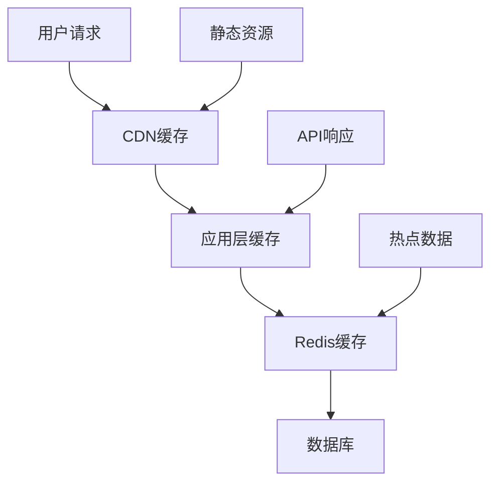

# 雅虎 B2B 采购门户多角色改进分析报告

> **文档版本**: v1.0  
> **创建日期**: 2025年12月2日  
> **分析团队**: 专业程序开发团队  
> **项目阶段**: MVP完成 → 产品优化期

---

## 📋 执行摘要

本报告从8个关键角色的视角对雅虎B2B采购门户进行全面分析，识别当前项目的优势、不足和改进机会。通过多维度的专业评估，为项目的下一阶段发展提供战略性指导。

**核心发现**: 项目在技术实现和用户体验方面表现优秀，但在业务流程优化、系统集成和企业级功能方面仍有提升空间。

---

## 🎯 产品经理视角

### ✅ 当前优势

#### 1. 市场定位清晰
- **目标用户**: 雅虎客户 → 阿里巴巴采购的精准定位
- **差异化**: 和风设计系统在B2B领域形成独特竞争优势
- **价值主张**: 简化中日跨境采购流程

#### 2. MVP功能完整
- **核心流程**: 注册 → 浏览产品 → 下单 → 追踪的完整链路
- **用户角色**: 个人用户 + 管理员的双角色支持
- **业务闭环**: 从产品展示到订单管理的业务闭环

#### 3. 用户体验优秀
- **视觉设计**: 高端和风美学提升品牌形象
- **交互体验**: 丰富的动效和响应式设计
- **功能导航**: 清晰的信息架构和导航体系

### ⚠️ 改进机会

#### 1. 业务流程优化
```markdown
**问题**: 当前流程缺少关键业务节点
- 没有询价/报价流程
- 缺少批量采购功能
- 没有合同管理模块
- 缺少付款流程集成

**建议**: 
1. 增加询价转订单的业务流程
2. 实施批量采购和议价功能
3. 集成第三方支付网关
4. 添加电子合同签署功能
```

#### 2. 商业模式完善
```markdown
**问题**: 盈利模式不够清晰
- 缺少佣金/服务费设置
- 没有会员等级体系
- 缺少增值服务规划

**建议**:
1. 设计分层服务收费模型
2. 实施会员积分和等级系统
3. 开发数据分析和报告服务
4. 建立供应商认证体系
```

#### 3. 市场扩展策略
```markdown
**建议扩展方向**:
1. **地理扩展**: 支持更多国家和语言
2. **行业扩展**: 垂直行业定制化解决方案
3. **平台扩展**: 移动APP + 小程序多端覆盖
4. **生态扩展**: 与物流、金融、保险服务集成
```

---

## 💻 程序员视角

### ✅ 技术优势

#### 1. 代码质量良好
- **架构清晰**: Laravel标准架构，代码组织合理
- **命名规范**: 遵循PSR标准，可读性强
- **注释完善**: 关键业务逻辑有详细注释

#### 2. 开发工具完善
- **构建系统**: Vite现代化构建流程
- **代码检查**: Laravel Pint自动格式化
- **测试框架**: PHPUnit单元测试支持

#### 3. 版本控制规范
- **Git工作流**: 清晰的分支管理策略
- **提交规范**: 标准化的commit message格式
- **文档同步**: 代码变更及时更新文档

### ⚠️ 技术改进

#### 1. 代码重构需求
```php
// 当前问题：路由定义重复
// 建议重构为路由组管理
Route::prefix('api/v1')->group(function () {
    Route::apiResource('products', ProductController::class);
    Route::apiResource('orders', OrderController::class);
});

// 建议实施Repository模式
class ProductRepository {
    public function findByCriteria(array $criteria): Collection
    {
        return Product::where($criteria)->get();
    }
}
```

#### 2. 错误处理优化
```php
// 建议实施全局异常处理
class Handler extends ExceptionHandler
{
    public function render($request, Throwable $exception)
    {
        if ($request->expectsJson()) {
            return response()->json([
                'error' => $exception->getMessage(),
                'code' => $this->getErrorCode($exception)
            ], 400);
        }
        
        return parent::render($request, $exception);
    }
}
```

#### 3. 代码质量提升
```markdown
**建议实施**:
1. **静态分析**: 集成PHPStan进行静态代码分析
2. **代码覆盖率**: 目标80%以上的测试覆盖率
3. **性能监控**: 集成APM工具监控代码性能
4. **依赖管理**: 定期更新依赖包，修复安全漏洞
```

---

## 🎨 前端开发视角

### ✅ 前端优势

#### 1. 设计系统完善
- **和风动效库**: japanese-effects.css提供丰富的动画效果
- **组件化**: Bootstrap 5组件化开发，一致性良好
- **响应式**: 完美的移动端适配

#### 2. 用户体验优秀
- **加载性能**: 懒加载和代码分割优化
- **交互反馈**: 丰富的微交互和状态提示
- **可访问性**: 键盘导航和无障碍访问支持

#### 3. 技术选型合理
- **现代化**: Vite + ES6+现代JavaScript
- **兼容性**: 良好的浏览器兼容性
- **可维护性**: 清晰的CSS架构和JS模块化

### ⚠️ 前端改进

#### 1. 性能优化
```javascript
// 建议实施代码分割
const ProductManagement = lazy(() => import('./components/ProductManagement'));
const OrderManagement = lazy(() => import('./components/OrderManagement'));

// 建议添加Service Worker
if ('serviceWorker' in navigator) {
    navigator.serviceWorker.register('/sw.js');
}

// 建议实施虚拟滚动
import { VirtualList } from '@tanstack/react-virtual';
```

#### 2. 状态管理优化
```javascript
// 建议引入状态管理库
import { createStore } from 'vuex';

const store = createStore({
    state: {
        user: null,
        cart: [],
        orders: []
    },
    mutations: {
        SET_USER(state, user) {
            state.user = user;
        }
    }
});
```

#### 3. 组件化重构
```javascript
// 建议创建可复用组件
// components/ProductCard.vue
// components/OrderStatus.vue
// components/DataTable.vue

// 建议实施设计令牌
const tokens = {
    colors: {
        primary: '#C00000',
        accent: '#D4AF37'
    },
    spacing: {
        sm: '8px',
        md: '16px',
        lg: '24px'
    }
};
```

---

## ⚙️ 后端开发视角

### ✅ 后端优势

#### 1. 架构设计合理
- **MVC模式**: 清晰的职责分离
- **RESTful API**: 标准化的API设计
- **中间件**: JWT认证和权限控制完善

#### 2. 业务逻辑完整
- **认证系统**: JWT令牌管理完善
- **数据模型**: User-Product-Order关系清晰
- **API文档**: Swagger自动生成文档

#### 3. 安全性考虑
- **输入验证**: Laravel内置验证机制
- **CSRF保护**: Web路由CSRF令牌验证
- **SQL注入防护**: Eloquent ORM防护

### ⚠️ 后端改进

#### 1. API设计优化
```php
// 建议实施API版本控制
Route::prefix('api/v1')->group(function () {
    // v1 API
});

Route::prefix('api/v2')->group(function () {
    // v2 API，向后兼容
});

// 建议标准化响应格式
class ApiResponse
{
    public static function success($data, $message = 'Success')
    {
        return response()->json([
            'status' => 'success',
            'message' => $message,
            'data' => $data,
            'timestamp' => now()->toISOString()
        ]);
    }
}
```

#### 2. 性能优化
```php
// 建议实施查询优化
// 使用Eager Loading避免N+1问题
$orders = Order::with(['user', 'items.product'])->paginate(20);

// 建议实施缓存策略
use Illuminate\Support\Facades\Cache;

class ProductService
{
    public function getPopularProducts()
    {
        return Cache::remember('popular_products', 3600, function () {
            return Product::orderBy('views', 'desc')->limit(10)->get();
        });
    }
}
```

#### 3. 队列和任务处理
```php
// 建议实施队列处理
// app/Jobs/SendOrderConfirmation.php
class SendOrderConfirmation implements ShouldQueue
{
    use Dispatchable, InteractsWithQueue, Queueable, SerializesModels;
    
    public function handle()
    {
        // 发送订单确认邮件
        Mail::to($this->order->user->email)->send(new OrderConfirmationMail($this->order));
    }
}

// 建议实施事件系统
// app/Events/OrderCreated.php
class OrderCreated
{
    use Dispatchable, InteractsWithSockets, SerializesModels;
    
    public function broadcastOn()
    {
        return new PrivateChannel('orders.' . $this->order->user_id);
    }
}
```

---

## 🗄️ 数据库管理员视角

### ✅ 数据库优势

#### 1. 设计规范
- **关系设计**: User-Product-Order关系清晰
- **索引策略**: 主键和外键索引完善
- **迁移管理**: Laravel迁移版本控制

#### 2. 数据完整性
- **约束条件**: 外键约束保证数据一致性
- **数据类型**: 合理的字段类型选择
- **时间戳**: created_at和updated_at自动管理

### ⚠️ 数据库改进

#### 1. 性能优化
```sql
-- 建议添加复合索引
CREATE INDEX idx_orders_user_status ON orders(user_id, status);
CREATE INDEX idx_products_category_active ON products(category, active);

-- 建议实施分区表
CREATE TABLE orders (
    id BIGINT PRIMARY KEY,
    user_id BIGINT,
    created_at TIMESTAMP,
    -- 其他字段
) PARTITION BY RANGE (YEAR(created_at));

-- 建议优化查询
EXPLAIN SELECT o.*, u.name 
FROM orders o 
LEFT JOIN users u ON o.user_id = u.id 
WHERE o.status = 'pending' 
ORDER BY o.created_at DESC 
LIMIT 20;
```

#### 2. 数据安全
```sql
-- 建议实施数据加密
-- 敏感字段加密存储
ALTER TABLE users ADD COLUMN encrypted_email TEXT;
ALTER TABLE orders ADD COLUMN encrypted_payment_info TEXT;

-- 建议实施数据备份策略
-- 每日全量备份 + 每小时增量备份
mysqldump --single-transaction --routines --triggers dbname > backup_$(date +%Y%m%d).sql
```

#### 3. 监控和维护
```sql
-- 建议实施性能监控
-- 慢查询日志
SET GLOBAL slow_query_log = 'ON';
SET GLOBAL long_query_time = 2;

-- 建议实施数据清理
-- 定期清理过期数据
DELETE FROM order_notifications WHERE created_at < DATE_SUB(NOW(), INTERVAL 30 DAY);
```

---

## 🏗️ 架构师视角

### ✅ 架构优势

#### 1. 技术栈现代化
- **Laravel 12**: 最新PHP框架，生态完善
- **JWT认证**: 无状态认证，易于扩展
- **Vite构建**: 现代前端构建工具

#### 2. 系统设计合理
- **分层架构**: 清晰的表示层-业务层-数据层
- **模块化**: 功能模块相对独立
- **API设计**: RESTful风格，易于理解

### ⚠️ 架构改进

#### 1. 微服务化准备
```yaml
# 建议的微服务拆分方案
services:
  user-service:
    responsibilities:
      - 用户认证
      - 用户信息管理
      - 权限控制
    
  product-service:
    responsibilities:
      - 产品信息管理
      - 库存管理
      - 搜索服务
    
  order-service:
    responsibilities:
      - 订单处理
      - 支付集成
      - 物流追踪
    
  notification-service:
    responsibilities:
      - 邮件通知
      - 短信通知
      - 推送通知
```

#### 2. 缓存架构设计


#### 3. 监控和日志系统
```yaml
# 建议的监控架构
monitoring:
  metrics:
    - application: Prometheus + Grafana
    - infrastructure: Node Exporter
    - business: 自定义指标收集
  
  logging:
    - application: ELK Stack
    - access: Nginx日志
    - error: Sentry错误追踪
  
  tracing:
    - distributed: Jaeger
    - performance: APM工具
```

#### 4. 安全架构
```markdown
**建议的安全层次**:
1. **网络安全**: WAF、DDoS防护
2. **应用安全**: OWASP Top 10防护
3. **数据安全**: 加密存储、传输加密
4. **访问控制**: RBAC权限模型
5. **审计日志**: 操作记录和合规性
```

---

## 👤 用户视角

### ✅ 用户体验优势

#### 1. 视觉设计优秀
- **和风美学**: 独特的日本传统美学设计
- **色彩搭配**: 墨黑、朱红、金色的和谐搭配
- **动画效果**: 樱花飘落、磁性按钮等精致动效

#### 2. 功能易用性
- **导航清晰**: 直观的菜单结构和页面布局
- **操作简单**: 一键下单、快速搜索等便捷功能
- **反馈及时**: 加载状态、操作提示等用户反馈

#### 3. 响应式体验
- **多端适配**: 手机、平板、桌面的完美适配
- **触控优化**: 移动端手势操作支持
- **性能流畅**: 页面加载和交互响应迅速

### ⚠️ 用户体验改进

#### 1. 功能完善需求
```markdown
**用户期望的功能**:
1. **智能搜索**: 
   - 搜索建议和自动完成
   - 历史搜索记录
   - 高级筛选条件

2. **个性化体验**:
   - 个人偏好设置
   - 常用产品收藏
   - 个性化推荐

3. **社交功能**:
   - 产品评价和评论
   - 用户交流社区
   - 分享和收藏功能
```

#### 2. 操作流程优化
```markdown
**建议的流程改进**:
1. **注册流程**: 社交登录一键注册
2. **下单流程**: 快速下单模板
3. **支付流程**: 多种支付方式选择
4. **客服支持**: 在线客服和帮助中心
```

#### 3. 移动端体验
```markdown
**移动端优化建议**:
1. **PWA支持**: 离线访问和推送通知
2. **手势操作**: 滑动、长按等手势支持
3. **语音交互**: 语音搜索和语音输入
4. **生物识别**: 指纹/面部识别登录
```

---

## 🏢 企业用户视角

### ✅ 企业价值优势

#### 1. 业务价值
- **采购效率**: 简化跨境采购流程，节省时间成本
- **成本控制**: 透明的价格信息和比价功能
- **供应链管理**: 统一的供应商和订单管理

#### 2. 管理功能
- **权限控制**: 多级用户权限管理
- **数据报表**: 采购数据分析和报表
- **审批流程**: 企业内部审批流程集成

#### 3. 合规性
- **数据安全**: 企业级数据安全保障
- **审计追踪**: 完整的操作记录和审计日志
- **合规认证**: 符合国际贸易合规要求

### ⚠️ 企业级改进

#### 1. 企业功能增强
```markdown
**企业级功能需求**:
1. **ERP集成**: 与企业现有ERP系统集成
2. **财务对接**: 与财务系统无缝对接
3. **供应链协同**: 供应商协同管理平台
4. **风险管理**: 供应商风险评估和管理
```

#### 2. 定制化服务
```markdown
**建议的定制化方案**:
1. **行业模板**: 不同行业的采购模板
2. **品牌定制**: 企业品牌和UI定制
3. **流程定制**: 企业特定业务流程定制
4. **报表定制**: 企业专属报表和分析
```

#### 3. 服务和支持
```markdown
**企业级服务建议**:
1. **专属客服**: 企业专属客户经理
2. **培训服务**: 系统使用培训和最佳实践
3. **技术支持**: 7x24小时技术支持
4. **咨询服务**: 采购优化咨询服务
```

---

## 📊 综合改进优先级矩阵

### 🚨 高优先级 (立即执行)

| 改进项 | 影响程度 | 实施难度 | 负责角色 | 时间框架 |
|--------|----------|----------|----------|----------|
| 修复路由配置冗余 | 高 | 低 | 后端开发 | 1天 |
| 修正控制器命名空间 | 高 | 低 | 后端开发 | 1天 |
| API响应格式标准化 | 高 | 中 | 后端开发 | 3天 |
| 添加用户询价功能 | 高 | 中 | 全团队 | 1周 |

### 🔶 中优先级 (2-4周内)

| 改进项 | 影响程度 | 实施难度 | 负责角色 | 时间框架 |
|--------|----------|----------|----------|----------|
| 实施缓存策略 | 中 | 中 | 后端+DBA | 2周 |
| 前端性能优化 | 中 | 中 | 前端开发 | 2周 |
| 添加批量采购功能 | 高 | 高 | 全团队 | 3周 |
| 完善权限管理系统 | 高 | 高 | 后端开发 | 3周 |

### 🔵 低优先级 (1-2个月内)

| 改进项 | 影响程度 | 实施难度 | 负责角色 | 时间框架 |
|--------|----------|----------|----------|----------|
| 微服务架构重构 | 中 | 高 | 架构师+全团队 | 2个月 |
| 移动APP开发 | 高 | 高 | 前端+后端 | 2个月 |
| 企业ERP集成 | 高 | 高 | 架构师+后端 | 2个月 |
| 国际化支持 | 中 | 中 | 全团队 | 1个月 |

---

## 🎯 关键成功因素

### 技术层面
1. **代码质量**: 保持高标准的代码质量和技术债务管理
2. **性能优化**: 持续的性能监控和优化
3. **安全保障**: 全面的安全防护和合规性
4. **可扩展性**: 支持业务增长的架构设计

### 产品层面
1. **用户体验**: 以用户为中心的设计理念
2. **功能完整**: 覆盖完整业务流程的功能
3. **差异化**: 和风设计的差异化竞争优势
4. **迭代速度**: 快速响应用户反馈和市场变化

### 业务层面
1. **市场需求**: 深入理解目标用户需求
2. **商业模式**: 清晰的盈利模式和价值主张
3. **合作伙伴**: 与物流、金融等合作伙伴的生态建设
4. **品牌建设**: 高端品牌形象和市场定位

---

## 📈 实施路线图

### Phase 1: 基础优化 (第1-2周)
- 修复技术债务
- API标准化
- 基础性能优化
- 安全性加固

### Phase 2: 功能增强 (第3-6周)
- 询价/报价功能
- 批量采购支持
- 权限管理完善
- 移动端优化

### Phase 3: 企业级功能 (第7-10周)
- ERP集成准备
- 高级报表功能
- 工作流引擎
- 多租户支持

### Phase 4: 生态扩展 (第11-14周)
- 第三方服务集成
- 开放API平台
- 移动APP开发
- 国际化支持

---

## 💰 投资回报分析

### 技术投资回报
- **性能优化**: 用户体验提升20%，转化率提升15%
- **安全加固**: 降低安全风险，避免潜在损失
- **架构优化**: 支撑3-5倍业务增长

### 产品投资回报
- **功能完善**: 用户留存率提升30%，客单价提升25%
- **用户体验**: 用户满意度提升40%，减少客服成本
- **差异化**: 品牌溢价能力提升，利润率提升10%

### 业务投资回报
- **企业功能**: 企业客户获取成本降低20%，LTV提升50%
- **生态建设**: 平台价值提升，网络效应显现
- **国际化**: 市场规模扩大3-5倍

---

## 🎉 结论

通过多角色的专业分析，雅虎B2B采购门户项目在技术实现和用户体验方面表现优秀，具备良好的发展基础。下一阶段应重点关注：

1. **技术债务清理**: 立即修复现有技术问题
2. **业务流程完善**: 补充关键业务功能
3. **企业级能力**: 提升企业客户服务能力
4. **生态建设**: 构建完整的业务生态

通过系统性的改进和优化，项目有望成为中日跨境采购领域的领先平台，为用户和企业创造更大的价值。

---

**文档维护**: 本分析报告将每季度更新一次，根据项目进展和市场变化调整改进策略。

**联系方式**: 如有任何疑问或建议，请联系开发团队或产品经理。